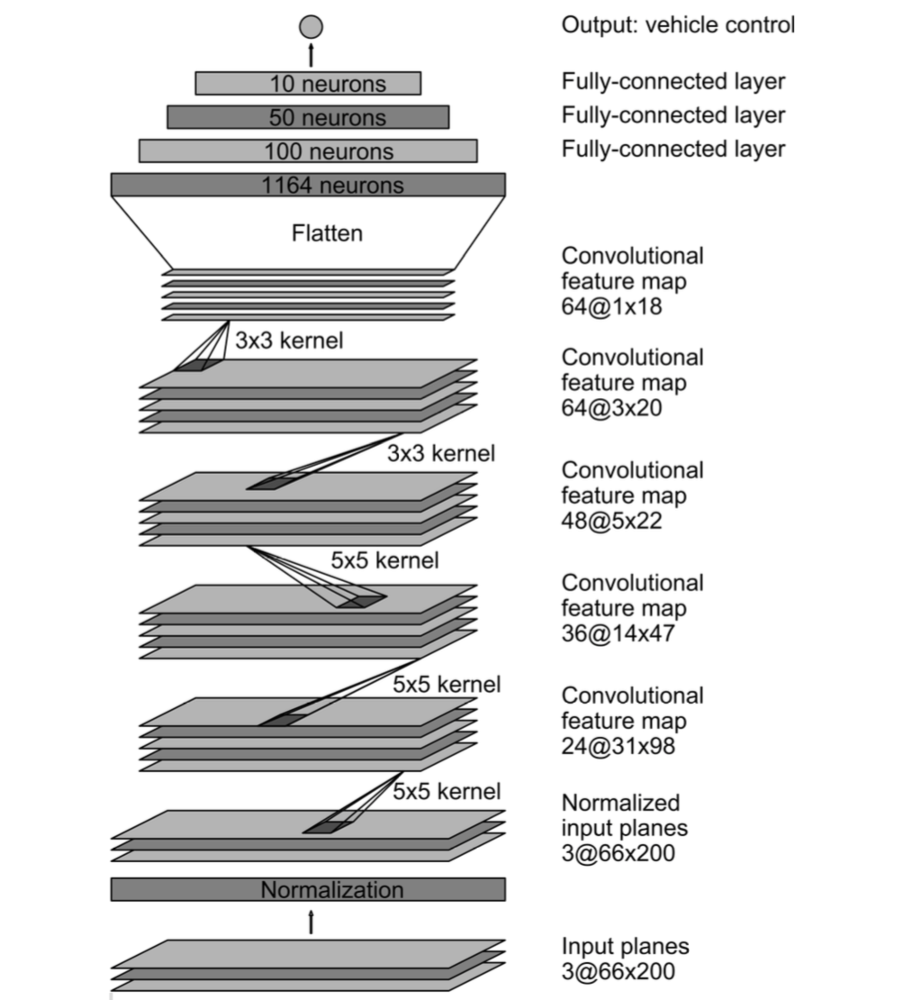
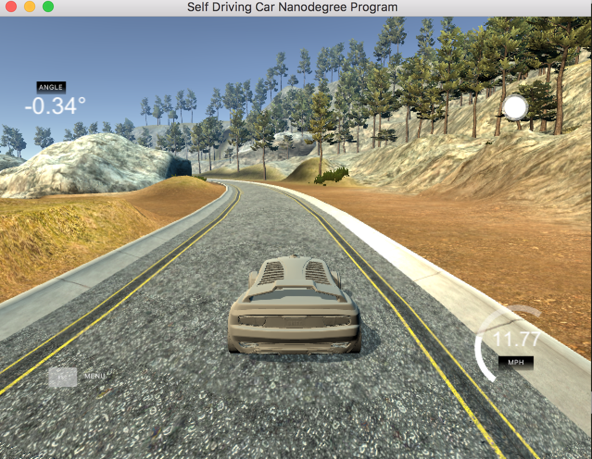

# Behavioral Cloning

##Description
This project use deepe learning to train a model to do the behavioral cloning of car driving. It build a CNN network with multiple layers.
The model input are images captured from the emulator cameras, and the steering wheel when driving in the emulator. The target of the model is to predict the
steering wheel angle by giving the new camera images when the car drive in different sceneries.

## Data Collection

The data collected from Udacity emulator. When select the car to training mode, you can control the car moving by mouse and keyboard.
1. 3327 records: Data collected from the Beta version Emulator use mouse as angel input
2. 8037 records: from udacity
3. 34703 records: from udacity students sharing

## Data PreProcessing

###Resize the data to 66*200*3 to adapt the Nvidia model image size
###Combine the all the data source into one input in the data generator and yield it
###Split data into train/validation/test
    1000 images for validation, 1000 images for test
###Shuffling

###RGB to YUV.
    The result from my data shows YUV didn't get better result, so I changed back to RGB.

## Model Training, Validation

The model was trained in Amazon AWS with g2.2xlarge GPU instance.

use fit_generator to generate data and save the memory

The model rarchitecture refer to Nvidia's paper. The model use 9 layers
###1 Normalization layer. I moved it to preprocess part
    The normalization will accelarate the computation speed by GPU.
###5 Convolutional layers.
First 3 layers use strides 2*2, and kernel 5*5. Last 2 layers use kernal 3*3 without strides.
###3 full connected layers.
3 fully connected layers with 1164,100,50,10 neurons. Finally output to steering angles.

In the first layers, we use 0.2 as dropout to remove overfitting issues, also use L2 Regularization.

Adam optimizer was used to optimize the model.

The training epochs use 5, each epoch has 25600 inputs samples by generator. The loss not change too much after epoch 3, so choose a safer number 5.

## Testing

Testing use 10% of the data to do the testing.
Also, pick 1 image from every 1000 images to do the prediction and manully validate the results.

## Simulate the result in autonomous mode
Modify the driver.py, add the preprocess function before send the data to the model.
Run driver.py with saved model.
Change the Emulator in AUTONOMOUS MODE and run.
The Emulator will run in autonomous mode, change the wheels according to different conditions.

## Improvements

## References

## TODOs
Add rotation.
Use left and right camera
Add more data to fix the cases when the car off the road

